<!-- ═══════════════════════════ HEADER ═══════════════════════════ -->
<div align="center">
  
</div>

<!-- ═══════════════════════════ TYPING ═══════════════════════════ -->
<div align="center">
  
</div>

<!-- ═══════════════════════════ SOCIAL ═══════════════════════════ -->
<div align="center">
  <a href="https://t.me/rahmatillo_dev"></a>
  <a href="https://t.me/rahmatillokh_web"></a>
  <a href="https://www.youtube.com/@rahmatillokh"></a>
  <a href="https://www.linkedin.com/in/rahmatillokh/"></a>
  <a href="https://instagram.com/rahmatillo.dev"></a>
  <a href="mailto:webcoder292@gmail.com"></a>
</div>

<div align="center">
  
  
  
</div>

<br />

<!-- ═══════════════════════════ ABOUT ═══════════════════════════ -->


## 🧑‍💻 About Me

```bash
$ whoami
> Rahmatillo — Full-Stack Developer

$ cat ~/.profile
> location   : Uzbekistan
> focus      : React · Next.js · TypeScript · Node.js
> learning   : System Design, Docker, PostgreSQL
> hobby      : Open Source, UI experiments, Linux ricing
> motto      : "Write code your future self will thank you for."

$ uptime
> coding since 2023 · still curious
```

- 🔭 Hozirda **full-stack web ilovalar** ustida ishlayapman
- 🌱 O'rganyapman: **Docker**, **PostgreSQL**, **System Design**
- 👯 Hamkorlikka ochiqman: **Open Source** loyihalar
- 💬 Menga savol bering: **React, Next.js, Node.js, MongoDB**
- ⚡ Fun fact: **Bir chashka choy = 100 qator kod**

<br clear="right" />

<!-- ═══════════════════════════ STACK ═══════════════════════════ -->
## 🛠️ Tech Stack

<table align="center">
  <tr>
    <td align="right"><b>Languages</b></td>
    <td></td>
  </tr>
  <tr>
    <td align="right"><b>Frontend</b></td>
    <td></td>
  </tr>
  <tr>
    <td align="right"><b>Backend</b></td>
    <td></td>
  </tr>
  <tr>
    <td align="right"><b>Tools &amp; Cloud</b></td>
    <td></td>
  </tr>
  <tr>
    <td align="right"><b>Workflow</b></td>
    <td></td>
  </tr>
</table>

<!-- ═══════════════════════════ STATS ═══════════════════════════ -->
## 📊 GitHub Stats

<div align="center">
  
  
</div>

<div align="center">
  
</div>

<!-- ═══════════════════════════ TROPHY ═══════════════════════════ -->
## 🏆 Trophies

<div align="center">
  
</div>

<!-- ═══════════════════════════ GRAPH ═══════════════════════════ -->
## 📈 Contribution Graph

<div align="center">
  
</div>

<!-- ═══════════════════════════ TETRIS ═══════════════════════════ -->
## 🎮 Contribution Tetris

<div align="center">
  <picture>
    <source media="(prefers-color-scheme: dark)" srcset="./assets/tetris-dark.svg" />
    <source media="(prefers-color-scheme: light)" srcset="./assets/tetris.svg" />
    
  </picture>
</div>

<div align="center">
  <sub>🧱 Har kuni yangilanadi — commitlarim tetromino bo'laklariga bo'linib, grafikni qaytadan yig'adi</sub>
</div>

<!-- ═══════════════════════════ PROJECTS ═══════════════════════════ -->
## 🚀 Featured Projects

<div align="center">
  <a href="https://github.com/rahmatillokh/youtube-downloader-app">
    
  </a>
  <a href="https://github.com/rahmatillokh/messenger-clone">
    
  </a>
</div>

<div align="center">
  <a href="https://github.com/rahmatillokh/telegram-web-app">
    
  </a>
  <a href="https://github.com/rahmatillokh/instagram-downloader-bot">
    
  </a>
</div>

<!-- ═══════════════════════════ QUOTE ═══════════════════════════ -->
<div align="center">
  
</div>

<br />

<div align="center">
  <b>⭐ Agar loyihalarim yoqsa, star bosishni unutmang!</b>
</div>

<!-- ═══════════════════════════ FOOTER ═══════════════════════════ -->

